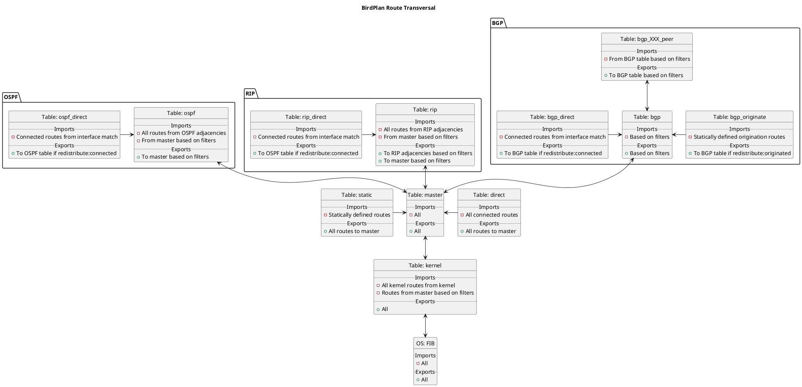

# Route Transversal

# Internal Route Preferences

|  Protocol  |  Pref  |  Description  |
|------------|--------|---------------|
| Direct | 240 | Directly connected interface routes |
| Static | 200 | Statically configured routes |
| Static (originated) | 195 | Originated routes (BirdPlan) |
| OSPF | 150 | IGP; for OSPF intra-area, inter-area and type 1 external routes |
| Babel | 130 | IGP |
| RIP | 120 | IGP |
| BGP | 100 | EGP |
| RPKI | 100 | RPKI routes |
| Inheriteed | 10	 | Routes inherited from other routing daemons |
