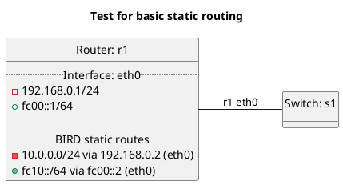

# Basic static routing

In terms of test "static":
  - Router r1 should install static routes into OS FIB.

In terms of test "static_no_export_kernel":
  - Router r1 should not install static routes into OS FIB.

