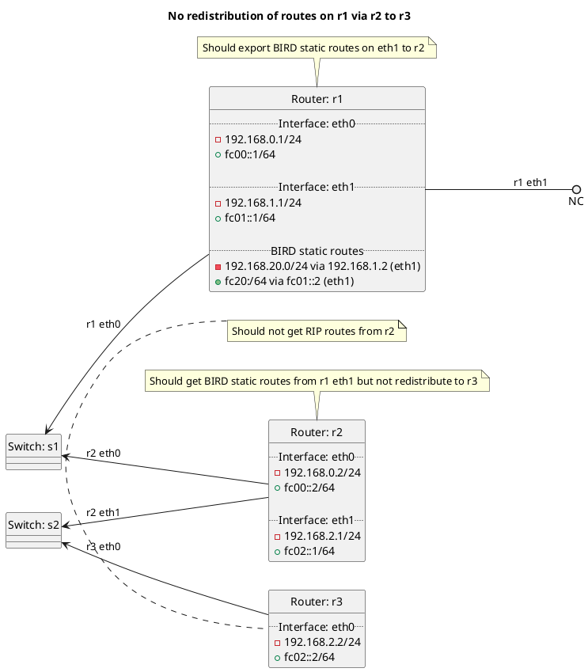

# No redistribution of RIP routes

Router r1 should be exporting the BIRD static routes on r1 interface eth1 to r2, should not be re-distributing RIP routes to r3.

```plantuml
@startuml
hide circle
title No redistribution of routes on r1 via r2 to r3
left to right direction


class "Router: r1" {
  .. Interface: eth0 ..
- 192.168.0.1/24
+ fc00::1/64

  .. Interface: eth1 ..
- 192.168.1.1/24
+ fc01::1/64

  .. BIRD static routes ..
- 192.168.20.0/24 via 192.168.1.2 (eth1)
+ fc20:/64 via fc01::2 (eth1)
}
note top: Should export BIRD static routes on eth1 to r2


class "Router: r2" {
  .. Interface: eth0 ..
- 192.168.0.2/24
+ fc00::2/64

  .. Interface: eth1 ..
- 192.168.2.1/24
+ fc02::1/64
}
note top: Should get BIRD static routes from r1 eth1 but not redistribute to r3


class "Router: r3" {
  .. Interface: eth0 ..
- 192.168.2.2/24
+ fc02::2/64
}
note top: Should not get RIP routes from r2

class "Switch: s1" {}
class "Switch: s2" {}


"Switch: s1" <-down- "Router: r1": r1 eth0
"Switch: s1" <-down- "Router: r2": r2 eth0

"Switch: s2" <-down- "Router: r2": r2 eth1
"Switch: s2" <-down- "Router: r3": r3 eth0

"Router: r1" --() NC: r1 eth1

@enduml
```
