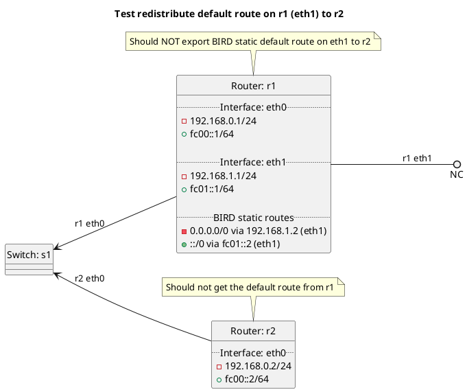

# RIP redistribution of BIRD default route

Router r1 should NOT advertise its default route on eth1 to router r2 because it is only exporting default and not static and the default route is a static route.

