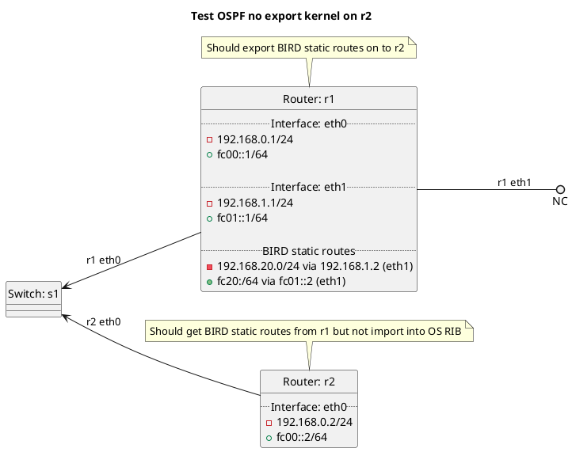

# OSPF no export kernel

Router r1 should be exporting the BIRD static routes to r2, r2 should receive the routes but not import into the OS RIB.

```plantuml
@startuml
hide circle
title Test OSPF no export kernel on r2
left to right direction


class "Router: r1" {
  .. Interface: eth0 ..
- 192.168.0.1/24
+ fc00::1/64

  .. Interface: eth1 ..
- 192.168.1.1/24
+ fc01::1/64

  .. BIRD static routes ..
- 192.168.20.0/24 via 192.168.1.2 (eth1)
+ fc20:/64 via fc01::2 (eth1)
}
note top: Should export BIRD static routes on to r2


class "Router: r2" {
  .. Interface: eth0 ..
- 192.168.0.2/24
+ fc00::2/64
}
note top: Should get BIRD static routes from r1 but not import into OS RIB


class "Switch: s1" {}


"Switch: s1" <-down- "Router: r1": r1 eth0
"Switch: s1" <-down- "Router: r2": r2 eth0
"Router: r1" --() NC: r1 eth1

@enduml
```
