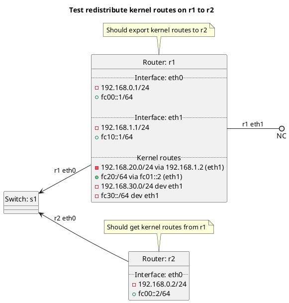

# OSPF redistribution of kernel routes

Router r1 should be exporting the kernel static routes to r2.

```plantuml
@startuml
hide circle
title Test redistribute kernel routes on r1 to r2
left to right direction


class "Router: r1" {
  .. Interface: eth0 ..
- 192.168.0.1/24
+ fc00::1/64

  .. Interface: eth1 ..
- 192.168.1.1/24
+ fc10::1/64

  .. Kernel routes ..
- 192.168.20.0/24 via 192.168.1.2 (eth1)
+ fc20:/64 via fc01::2 (eth1)
- 192.168.30.0/24 dev eth1
- fc30::/64 dev eth1
}
note top: Should export kernel routes to r2


class "Router: r2" {
  .. Interface: eth0 ..
- 192.168.0.2/24
+ fc00::2/64
}
note top: Should get kernel routes from r1


class "Switch: s1" {}


"Switch: s1" <-down- "Router: r1": r1 eth0
"Switch: s1" <-down- "Router: r2": r2 eth0
"Router: r1" --() NC: r1 eth1

@enduml
```
