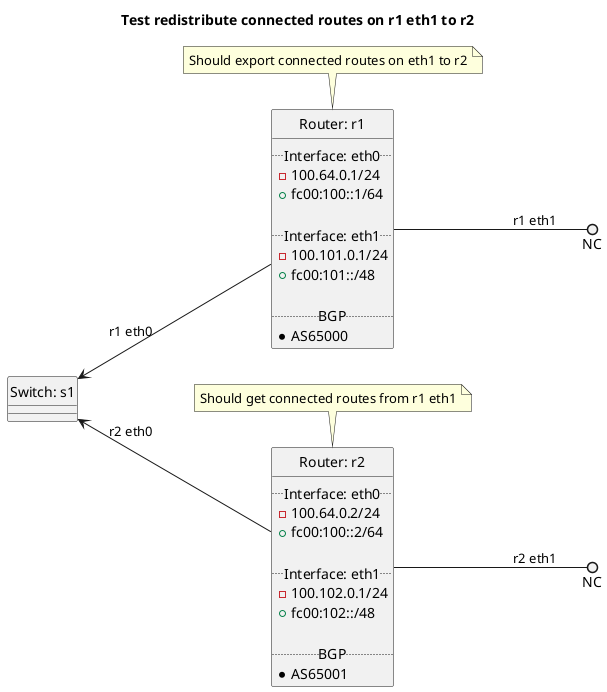

# BGP redistribution of connected routes

Router r1 should be exporting its connected routes for `eth1` to r2.

```plantuml
@startuml
hide circle
title Test redistribute connected routes on r1 eth1 to r2
left to right direction


class "Router: r1" {
  .. Interface: eth0 ..
- 100.64.0.1/24
+ fc00:100::1/64

  .. Interface: eth1 ..
- 100.101.0.1/24
+ fc00:101::/48

  .. BGP ..
* AS65000
}
note top: Should export connected routes on eth1 to r2


class "Router: r2" {
  .. Interface: eth0 ..
- 100.64.0.2/24
+ fc00:100::2/64

  .. Interface: eth1 ..
- 100.102.0.1/24
+ fc00:102::/48

  .. BGP ..
* AS65001
}
note top: Should get connected routes from r1 eth1


class "Switch: s1" {}


"Switch: s1" <-down- "Router: r1": r1 eth0
"Switch: s1" <-down- "Router: r2": r2 eth0
"Router: r1" --() NC: r1 eth1
"Router: r2" --() NC: r2 eth1

@enduml
```
