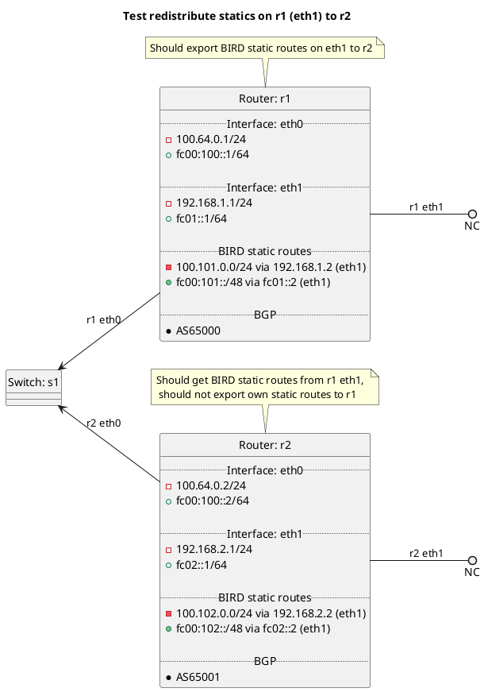

# BGP redistribution of BIRD static routes

Router r1 should be exporting the BIRD static routes on r1 interface eth1 to r2, r2 should only get routes from r1 eth1. Router
r2 should not be exporting its own static routes via BGP to r1 as it does not have redistribute:static set to True.

