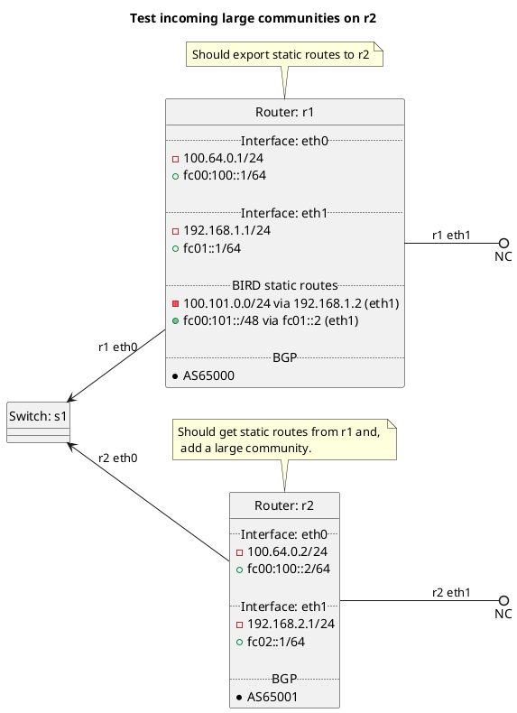

# BGP adding of incoming large communities

Router r1 should be exporting its static routes to r2, r2 should receive the static routes and add an incoming large community.

```plantuml
@startuml
hide circle
title Test incoming large communities on r2
left to right direction


class "Router: r1" {
  .. Interface: eth0 ..
- 100.64.0.1/24
+ fc00:100::1/64

  .. Interface: eth1 ..
- 192.168.1.1/24
+ fc01::1/64

  .. BIRD static routes ..
- 100.101.0.0/24 via 192.168.1.2 (eth1)
+ fc00:101::/48 via fc01::2 (eth1)

  .. BGP ..
* AS65000
}
note top: Should export static routes to r2


class "Router: r2" {
  .. Interface: eth0 ..
- 100.64.0.2/24
+ fc00:100::2/64

  .. Interface: eth1 ..
- 192.168.2.1/24
+ fc02::1/64

  .. BGP ..
* AS65001
}
note top: Should get static routes from r1 and, \n add a large community.


class "Switch: s1" {}


"Switch: s1" <-down- "Router: r1": r1 eth0
"Switch: s1" <-down- "Router: r2": r2 eth0
"Router: r1" --() NC: r1 eth1
"Router: r2" --() NC: r2 eth1

@enduml
```
