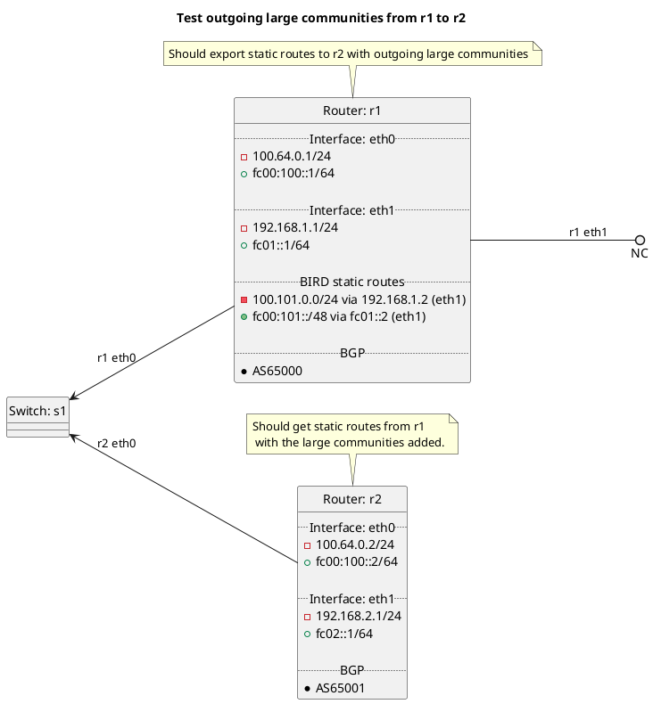

# BGP adding of outgoing large communities

Router r1 should be exporting its static routes to r2 with outgoing large communities, r2 should receive the static routes from r1 with the large communities added.

