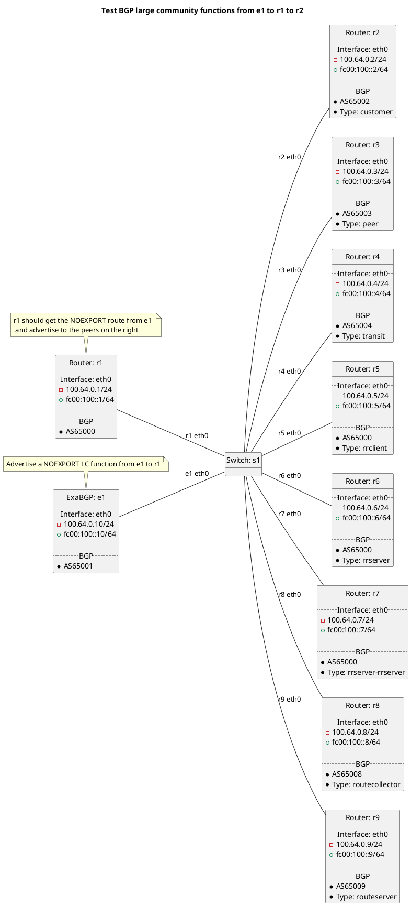

# BGP filtering tests

Router r1 should be receiving routes from e1 test cases. As we are dealing with filtering r1's main BGP routing table should be blank and the routes in the BGP peer routing table should all be marked filtered.

Tests done include:
  * NOEXPORT for PEER_ASN
    * Peer types: customer, peer, transit, rrclient, rrserver, rrserver-rrserver, routecollector, routeserver
  * NOEXPORT for the transit peer type
    * Peer types: customer, peer, transit, rrclient, rrserver, rrserver-rrserver, routecollector, routeserver
  * NOEXPORT for the peer peer type
    * Peer types: customer, peer, transit, rrclient, rrserver, rrserver-rrserver, routecollector, routeserver
  * NOEXPORT for the customer peer type
    * Peer types: customer, peer, transit, rrclient, rrserver, rrserver-rrserver, routecollector, routeserver
  * PREPEND 1x
    * Peer types: customer, peer, transit, rrclient, rrserver, rrserver-rrserver, routecollector, routeserver
  * PREPEND 2x
    * Peer types: customer, peer, transit, rrclient, rrserver, rrserver-rrserver, routecollector, routeserver
  * PREPEND 3x
    * Peer types: customer, peer, transit, rrclient, rrserver, rrserver-rrserver, routecollector, routeserver

