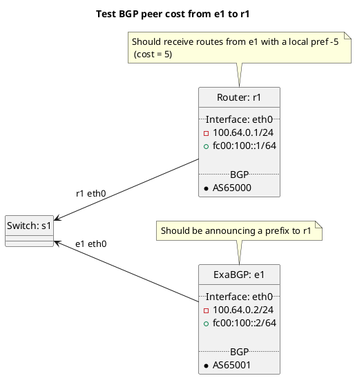

# BGP peer cost tests

Router r1 should be receiving routes from e1 test cases with a local pref -5 (cost = 5).

Tests done include:
  * Cost
    * Peer types: customer, peer, transit, rrclient, rrserver, rrserver-rrserver, routecollector, routeserver

