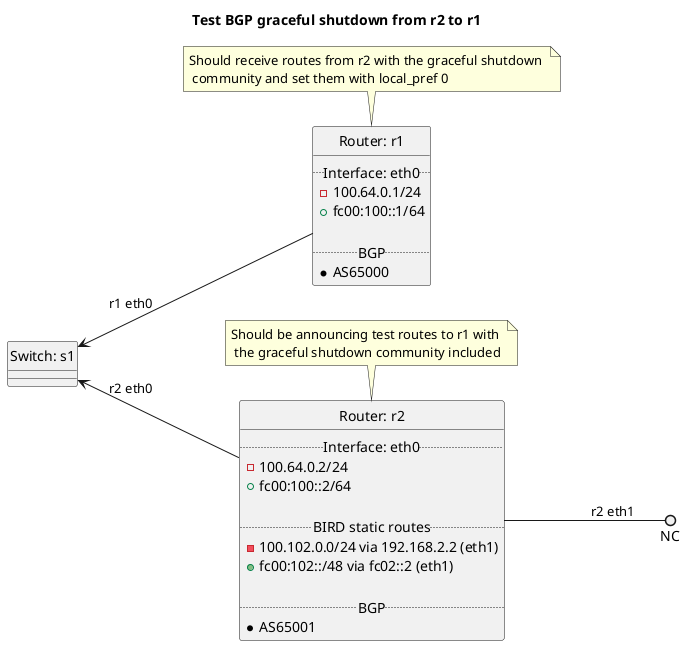

# BGP graceful shutdown tests

Router r1 should be receiving routes from r2 that include the graceful shutdown community.

Tests done include:
  * Graceful shutdown
    * Peer types: customer, peer, transit, rrclient, rrserver, rrserver-rrserver, routecollector, routeserver

