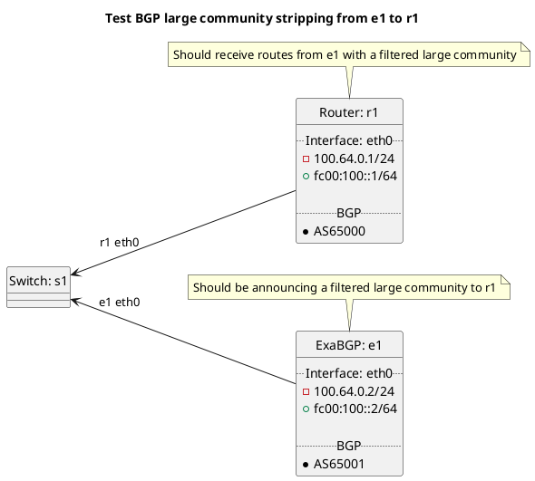

# BGP community strippings tests

Router r1 should be receiving routes from e1 test cases.

Tests done include:
  * Stripping large community - filtered
    * Peer types: customer, peer, transit, rrclient, rrserver, rrserver-rrserver, routecollector, routeserver

