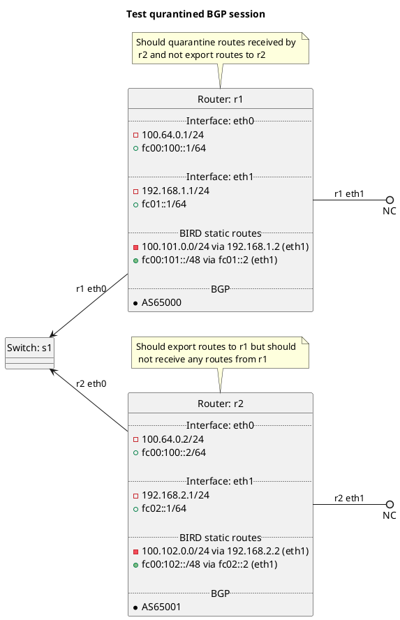

# BGP quarantine feature

Router r1 should be populating the BGP peering table with routes we would export, but not actually export them to r2.
Router r1 should be adding the `ASN:FILTERED:QUARANTINED` community to the incoming routes in the BGP peering table and should not be propagating them to the main BGP table as they're filtered.
Router r2 should be exporting its routes to r1.

## Goals
 - Tag all inbound routes with `ASN:FILTERED:QUARANTINED`
 - Show what routes would be exported, but not export them

