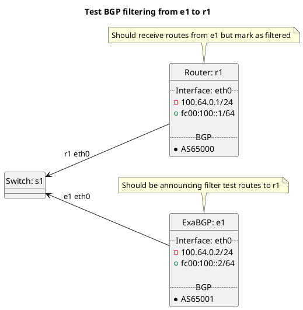

# BGP filtering tests

Router r1 should be receiving routes from e1 test cases. As we are dealing with filtering r1's main BGP routing table should be blank and the routes in the BGP peer routing table should all be marked filtered.

Tests done include:
  * Prefix length too long
    * Peer types: customer, peer, transit, rrclient, rrserver, rrserver-rrserver, routecollector, routeserver
  * Bogon filtering
    * Peer types: customer, peer, transit, rrclient, rrserver, rrserver-rrserver, routecollector, routeserver
  * Bogon ASN filtering
    * Peer types: customer, peer, transit, rrclient, rrserver, rrserver-rrserver, routecollector, routeserver
  * AS path too long filtering
    * Peer types: customer, peer, transit, rrclient, rrserver, rrserver-rrserver, routecollector, routeserver
  * AS path too short filtering
    * Peer types: customer, peer, transit, rrclient, rrserver, rrserver-rrserver, routecollector, routeserver
  * First AS not peer AS
    * Peer types: customer, peer, transit, rrclient, rrserver, rrserver-rrserver, routecollector, routeserver
  * Nexthop not peer IP
    * Peer types: customer, peer, transit, rrclient, rrserver, rrserver-rrserver, routecollector, routeserver

