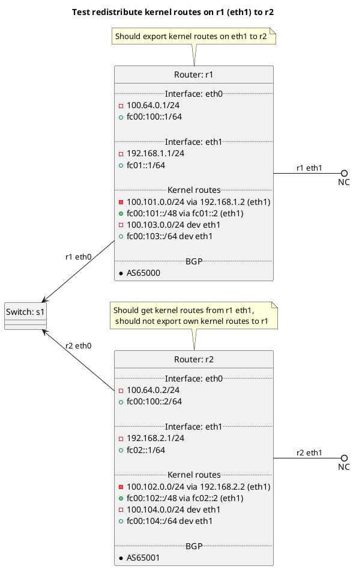

# BGP redistribution of kernel routes

Router r1 should be exporting the kernel routes on r1 interface eth1 to r2, r2 should only get routes from r1 eth1. Router
r2 should not be exporting its own kernel routes via BGP to r1 as it does not have redistribute:kernel set to True.

