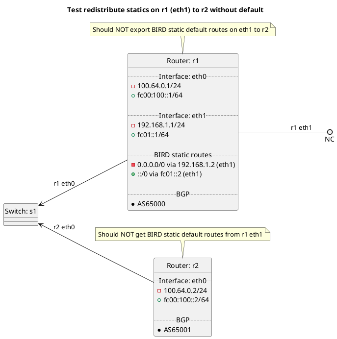

# BGP redistribution of BIRD static routes without default

Router r1 should not be exporting the BIRD static default route on r1 interface eth1 to r2 as `redistribute:default` defaults to False.

```plantuml
@startuml
hide circle
title Test redistribute statics on r1 (eth1) to r2 without default
left to right direction

class "Router: r1" {
  .. Interface: eth0 ..
- 100.64.0.1/24
+ fc00:100::1/64

  .. Interface: eth1 ..
- 192.168.1.1/24
+ fc01::1/64

  .. BIRD static routes ..
- 0.0.0.0/0 via 192.168.1.2 (eth1)
+ ::/0 via fc01::2 (eth1)

  .. BGP ..
* AS65000
}
note top: Should NOT export BIRD static default routes on eth1 to r2


class "Router: r2" {
  .. Interface: eth0 ..
- 100.64.0.2/24
+ fc00:100::2/64

  .. BGP ..
* AS65001
}
note top: Should NOT get BIRD static default routes from r1 eth1


class "Switch: s1" {}


"Switch: s1" <-down- "Router: r1": r1 eth0
"Switch: s1" <-down- "Router: r2": r2 eth0

"Router: r1" --() NC: r1 eth1

@enduml
```
