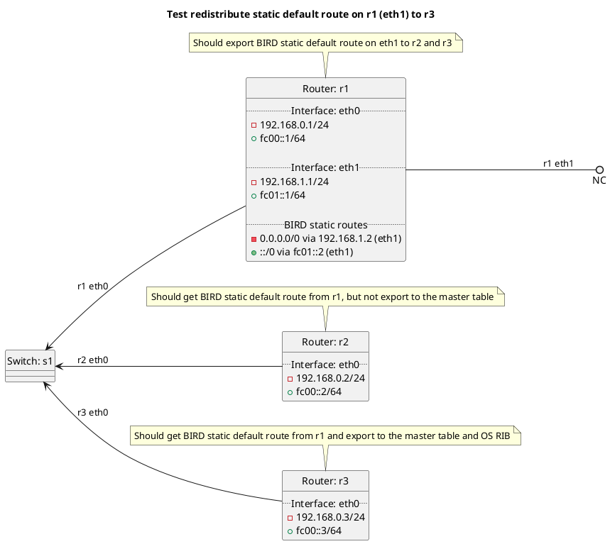

# RIP redistribution of BIRD static default route

Router r1 should advertise its default route on eth1 to router r2 and router r3. Router r2 should reject the incoming route into the master table and OS RIB as it does not have `accept:default` set to `True`, router r3 should accept the route into the master table and export it to the OS RIB as it has `accept:default` set to `True`.

