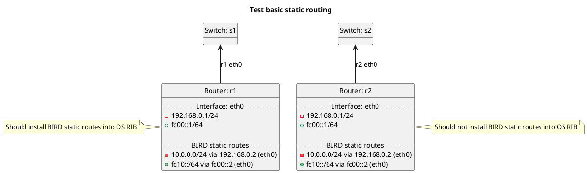

# Basic static routing (incl. export_kernel false test)

Router r1 should install static routes into OS RIB. Router r2 should not install static routes into OS RIB.

```plantuml
@startuml
hide circle
title Test basic static routing


class "Router: r1" {
  .. Interface: eth0 ..
- 192.168.0.1/24
+ fc00::1/64

  .. BIRD static routes ..
- 10.0.0.0/24 via 192.168.0.2 (eth0)
+ fc10::/64 via fc00::2 (eth0)
}
note left: Should install BIRD static routes into OS RIB


class "Router: r2" {
  .. Interface: eth0 ..
- 192.168.0.1/24
+ fc00::1/64

  .. BIRD static routes ..
- 10.0.0.0/24 via 192.168.0.2 (eth0)
+ fc10::/64 via fc00::2 (eth0)
}
note right: Should not install BIRD static routes into OS RIB


class "Switch: s1" {}
class "Switch: s2" {}


"Switch: s2" <-down- "Router: r2": r2 eth0
"Switch: s1" <-down- "Router: r1": r1 eth0


@enduml
```
