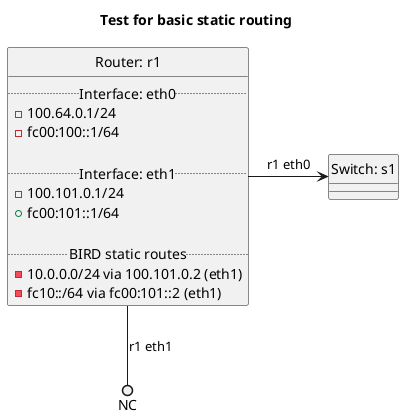

# Basic static routing

In terms of test `static`:  **(default)**
  - Router r1 should install static routes into OS RIB.

In terms of test `export_kernel_static_false`:
  - Router r1 should not install static routes into OS RIB.

In terms of test `export_kernel_static_true`:
  - Router r1 should install static routes into OS RIB.

## Diagram

