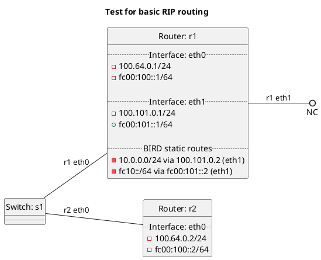

# Basic RIP test

In terms of test "rip":
  - Router r1 should install RIP routes into OS RIB. (default)

In terms of test "export_kernel_rip_false":
  - Router r1 should not install RIP routes into OS RIB.

In terms of test "export_kernel_rip_true":
  - Router r1 should install RIP routes into OS RIB.

