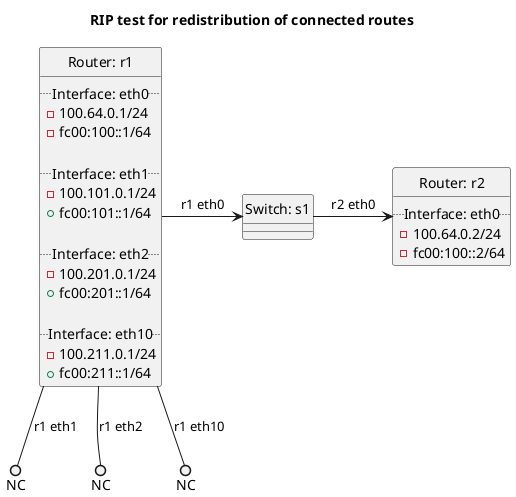

# RIP test for redistribution of connected routes

In the case of `redistribute_connected`: **(default)**
  - r1 should not be exporting its connected routes to r2, as we do not export connected routes by default.

In the case of `redistribute_connected_false`:
  - r1 should not be exporting its connected routes to r2 as `redistribute:connected` is set to False.

In the case of `redistribute_connected_true`:
  - r1 should be exporting its connected routes to r2 as `redistribute:connected` is set to True.

In the case of `redistribute_connected_list`:
  - r1 should be exporting its connected routes on eth1 to r2 as `redistribute:connected` has eth1 in its list.

In the case of `redistribute_connected_star`:
  - r1 should be exporting its connected routes on eth1 and eth10 to r2 as `redistribute:connected` has eth1* in its list.

## Diagram

