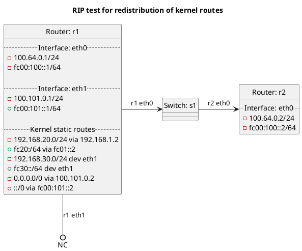

# RIP test for redistribution of kernel routes

In the case of "redistribute_kernel": **(default)**
  - Router r1 should not be exporting its kernel routes to r2.

In the case of "redistribute_kernel_false":
  - Router r1 should not be exporting its kernel routes to r2.

In the case of "redistribute_kernel_true":
  - Router r1 should be exporting its kernel routes to r2, but not the default route.

## Diagram

