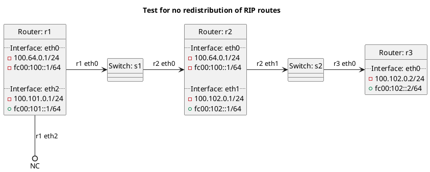

# Test for no redistribution of RIP routes

In the case of `redistribute_rip`: **(default)**
  - r2 should be exporting its RIP routes to r3, but not the default route.

In the case of `redistribute_rip_false`:
  - r2 should not be exporting any RIP routes to r3.

In the case of `redistribute_rip_true`:
  - r2 should be exporting its RIP routes to r3, but not the default route.

## Diagram

