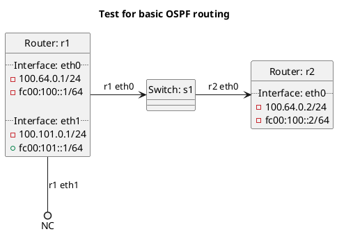

# Basic OSPF test

In terms of test `ospf`:  **(default)**
  - Router r1 should export routes to r2 and r2 should insert routes into its RIB.

In terms of test `ospf_no_export_kernel`:
  - Router r1 should export routes to r2 and r2 should NOT insert routes into its RIB.

This setup uses OSPF v3 explicitly specified for IPv4.

## Diagram

