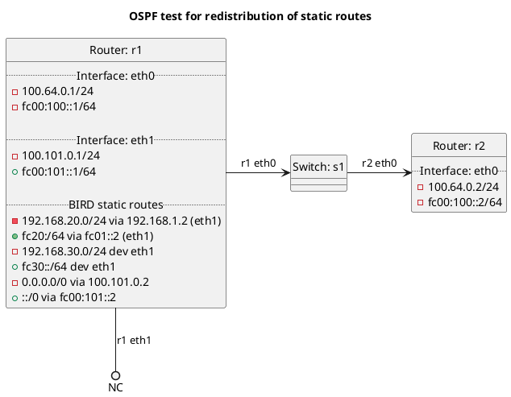

# OSPF test for redistribution of static routes

In the case of "redistribute_static": **(default)**
  - Router r1 should not be exporting its static routes to r2

In the case of "redistribute_static_false"
  - Router r1 should not be exporting its static routes to r2

In the case of "redistribute_static_true"
  - Router r1 should be exporting its static routes to r2

## Diagram

