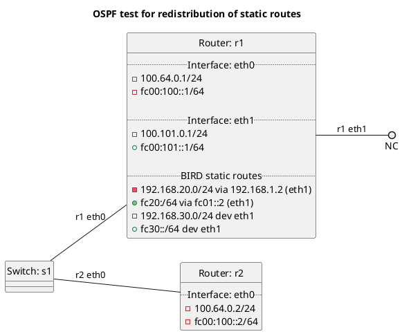

# OSPF test for redistribution of static routes

Router r1 should export its static routes on eth1 to r2.

```plantuml
@startuml
hide circle
title OSPF test for redistribution of static routes
left to right direction


class "Router: r1" {
  .. Interface: eth0 ..
- 100.64.0.1/24
- fc00:100::1/64

  .. Interface: eth1 ..
- 100.101.0.1/24
+ fc00:101::1/64

  .. BIRD static routes ..
- 192.168.20.0/24 via 192.168.1.2 (eth1)
+ fc20:/64 via fc01::2 (eth1)
- 192.168.30.0/24 dev eth1
+ fc30::/64 dev eth1
}


class "Router: r2" {
  .. Interface: eth0 ..
- 100.64.0.2/24
- fc00:100::2/64
}


class "Switch: s1" {}


"Switch: s1" -- "Router: r1": r1 eth0
"Switch: s1" -- "Router: r2": r2 eth0
"Router: r1" --() NC: r1 eth1

@enduml
```
