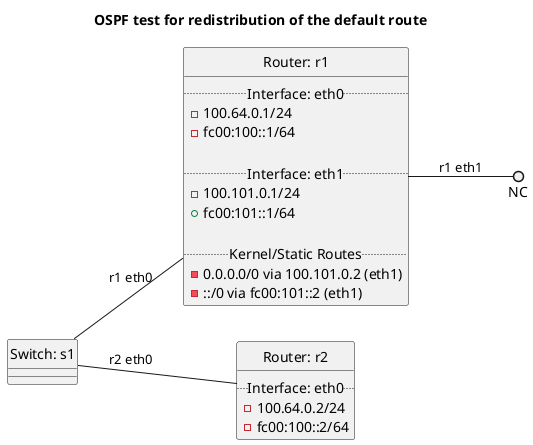

# OSPF test for redistribution of the default route

*Kernel default route tests:*

In terms of test "t10_kernel/test_accept_default_false":
  - Router r1 should export the kernel default route to r2, but r2 should not accept it as it has accept:default set to false.

In terms of test "t10_kernel/test_accept_default_true":
  - Router r1 should export the kernel default route to r2, r2 should accept the default route as it has accept:default set to true.

In terms of test "t10_kernel/test_accept_default":
  - Router r1 should export the kernel default route to r2, but r2 should not accept it as it does not accept default routes by default.

In terms of test "t10_kernel/test_redistribute_default_false":
  - Router r1 should not export the kernel default route to r2 as we have redistribute:default set to false.

In terms of test "t10_kernel/test_redistribute_default_true":
  - Router r1 should export the kernel default route to r2 as we have redistribute:default set to true.

In terms of test "t10_kernel/test_redistribute_default":
  - Router r1 should not export the kernel default route to r2 as we do not redistribute the default route by default.

*Static default route tests:*

In terms of test "t10_static/test_accept_default_false":
  - Router r1 should export the static default route to r2, but r2 should not accept it as it has accept:default set to false.

In terms of test "t10_static/test_accept_default_true":
  - Router r1 should export the static default route to r2, r2 should accept the default route as it has accept:default set to true.

In terms of test "t10_static/test_accept_default":
  - Router r1 should export the static default route to r2, but r2 should not accept it as it does not accept default routes by default.

In terms of test "t10_static/test_redistribute_default_false":
  - Router r1 should not export the static default route to r2 as we have redistribute:default set to false.

In terms of test "t10_static/test_redistribute_default_true":
  - Router r1 should export the static default route to r2 as we have redistribute:default set to true.

In terms of test "t10_static/test_redistribute_default":
  - Router r1 should not export the static default route to r2 as we do not redistribute the default route by default.

