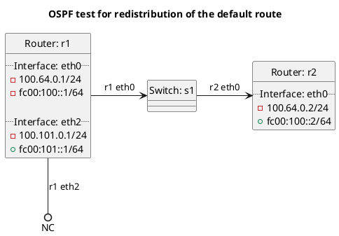

# OSPF test for redistribution of the default route

## t10_kernel - Kernel default route tests

In terms of test `accept_default`: **(default)**
  - Router r1 should export the kernel default route to r2, but r2 should not accept it as it does not accept default routes by default.

In terms of test `accept_default_false`:
  - Router r1 should export the kernel default route to r2, but r2 should not accept it as it has `accept:default` set to false.

In terms of test `accept_default_true`:
  - Router r1 should export the kernel default route to r2, r2 should accept the default route as it has `accept:default` set to true.

In terms of test `redistribute_default`: **(default)**
  - Router r1 should not export the kernel default route to r2 as we do not redistribute the default route by default.

In terms of test `redistribute_default_false`:
  - Router r1 should not export the kernel default route to r2 as we have `redistribute:kernel_default` set to false.

In terms of test `redistribute_default_true`:
  - Router r1 should export the kernel default route to r2 as we have `redistribute:kernel_default` set to true.

## t20_static - Static default route tests

In terms of test `accept_default`: **(default)**
  - Router r1 should export the static default route to r2, but r2 should not accept it as it does not accept default routes by default.

In terms of test `accept_default_false`:
  - Router r1 should export the static default route to r2, but r2 should not accept it as it has `accept:default` set to false.

In terms of test `accept_default_true`:
  - Router r1 should export the static default route to r2, r2 should accept the default route as it has `accept:default` set to true.

In terms of test `redistribute_default`: **(default)**
  - Router r1 should not export the static default route to r2 as we do not redistribute the default route by default.

In terms of test `redistribute_default_false`:
  - Router r1 should not export the static default route to r2 as we have `redistribute:static_default` set to false.

In terms of test `redistribute_default_true`:
  - Router r1 should export the static default route to r2 as we have `redistribute:stastic_default` set to true.

## Diagram

