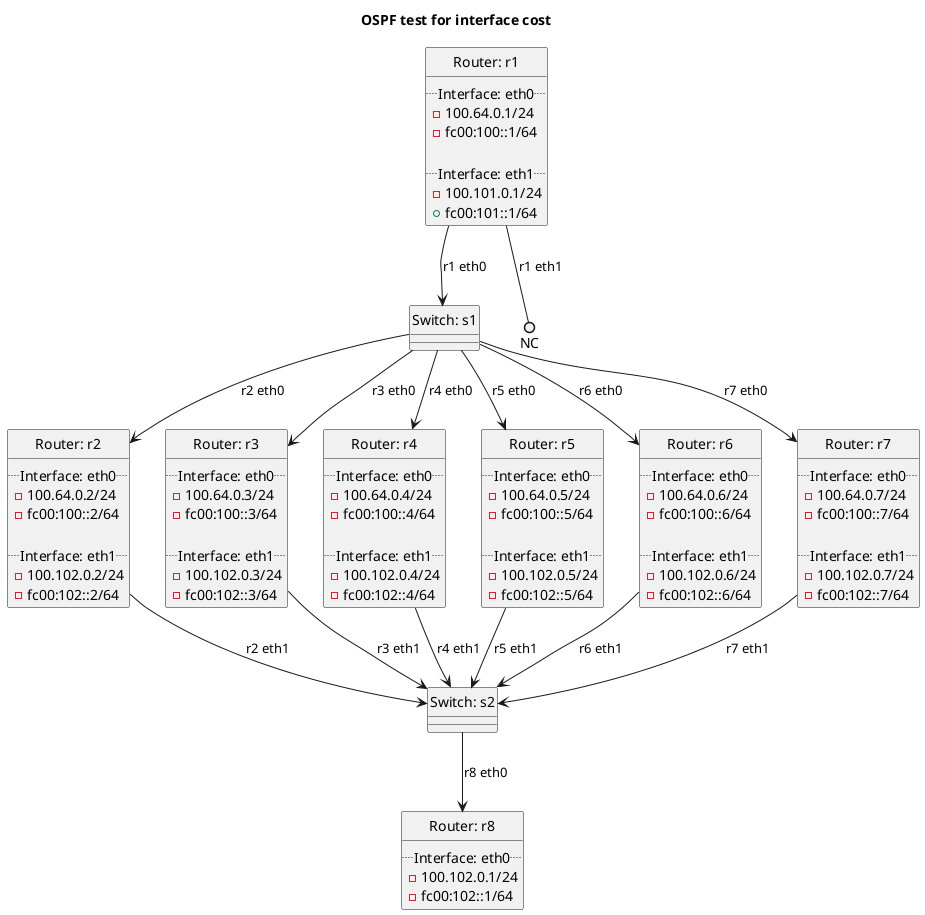

# OSPF tests for interface cost

In the case of `t10_basic`:
  - Test OSPF interface cost between routers using default values.

In the case of `t20_conffile`:
  - Test OSPF interface cost when set in a configuration file.

In the case of `t30_commandline`:
  - Test OSPF interface cost when set in a configuration file.

In the case of `t32_commandline_pattern`:
  - Test OSPF interface cost when overridden from commandline using an interface pattern.

## Diagram

