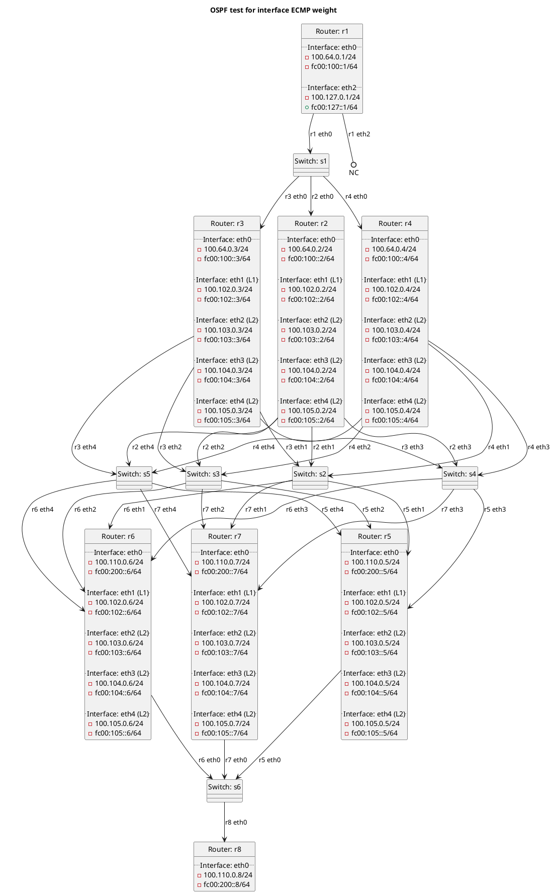

# OSPF tests for interface ECMP weight

We're testing router r2, r3, r4 connected to r5, r6, r7 via 4 links.

In the case of `t10_basic`:
  - Test OSPF interface ECMP weight between routers using default values.

In the case of `t20_conffile`:
  - Test OSPF interface ECMP weight when set in a configuration file.

In the case of `t30_commandline`:
  - Test OSPF interface ECMP weight when overridden from commandline.

In the case of `t32_commandline_pattern`:
  - Test OSPF interface ECMP weight when overridden from commandline using an interface pattern.

## Diagram

