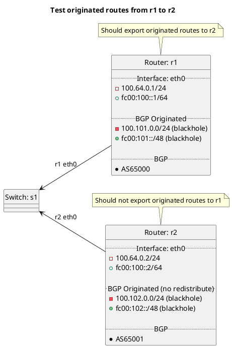

# BGP basic test with originated routes between peers

Router r1 should be exporting its originated routes to r2, r2 should not be exporting its own originated routes to r1 as redistribute:originated is not set to True. r2 should however be receiving and importing the originated routes from r1.

