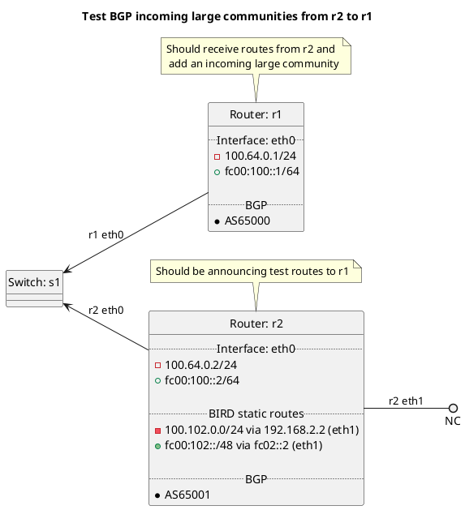

# BGP incoming large community tests

Router r1 should be receiving routes from r2 and add an incoming large community.

Tests done include:
  * Incoming large communities
    * Peer types: customer, peer, transit, rrclient, rrserver, rrserver-rrserver, routecollector, routeserver

