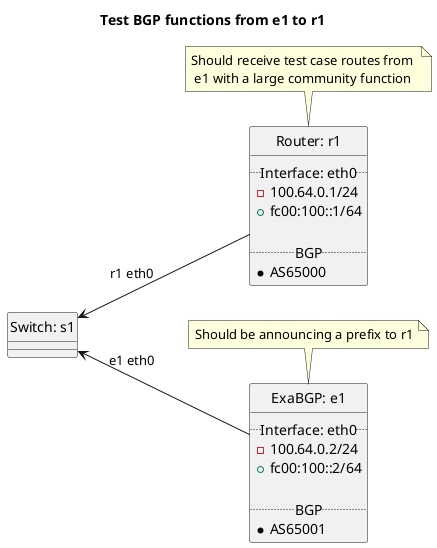

# BGP large community function tests (inbound)

Router r1 should be receiving routes from e1 test cases.

Tests done include:
  * LOCAL_PREF Attribute Manipulation
    * Peer types: customer, peer, transit, rrclient, rrserver, rrserver-rrserver, routecollector, routeserver

