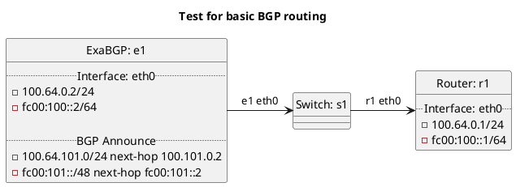

# Basic BGP test

ExaBGP e1 should be announcing its route to r1 for testing each peer type.

In terms of test "bgp":  **(default)**
  - Router r1 should install BGP routes into OS RIB as this is default behavior.

In terms of test "export_kernel_bgp_false":
  - Router r1 should not install BGP routes into OS RIB as `export:kernel` is set to False.

In terms of test "export_kernel_bgp_true":
  - Router r1 should install BGP routes into OS RIB as `export:kernel` is set to True.

## Diagram

