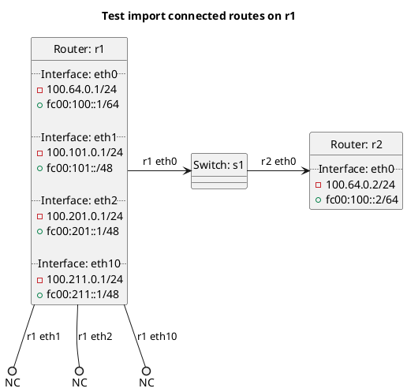

# BGP importing of connected routes

In the case of `import_connected`:  **(default)**
  - r1 should not be importing any routes by default.

In the case of `import_connected_false`:
  - r1 should not be importing routes from any interfaces.

In the case of `import_connected_list`:
  - r1 should be importing routes from the list of interfaces.

In the case of `import_connected_star`:
  - r1 should be importing routes from the matched interfaces.

In the case of `import_connected_true`:
  - r1 should be importing routes from all interfaces.

## Diagram

