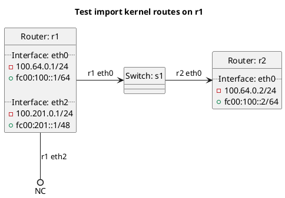

# BGP importing of kernel routes

In the case of `test_import_kernel`: **(default)**
  - r1 should not be importing kernel routes by default.

In the case of `test_import_kernel_true`:
  - r1 should be importing kernel routes and not blackhole routes.

In the case of `test_import_kernel_false`:
  - r1 should not be importing kernel routes.

In the case of `test_import_kernel_blackhole_true`:
  - r1 should be importing kernel blackhole routes but not normal kernel routes.

In the case of `test_import_kernel_blackhole_false`:
  - r1 should not be importing kernel routes.

In the case of `test_import_kernel_default_true`:
  - r1 should be importing kernel default routes but not normal kernel routes.

In the case of `test_import_kernel_default_false`:
  - r1 should not be importing kernel routes.

## Diagram

