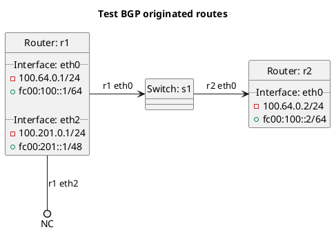

# BGP basic test to accept originated routes

Test originated routes from r1 to r2.

In the case of `test_accept_originated`: **(default)**
  - r1 should be accepting originated routes by default.

In the case of `test_accept_originated_true`:
  - r1 should be accepting originated routes.

In the case of `test_accept_originated_false`:
  - r1 should not be accepting originated routes.

