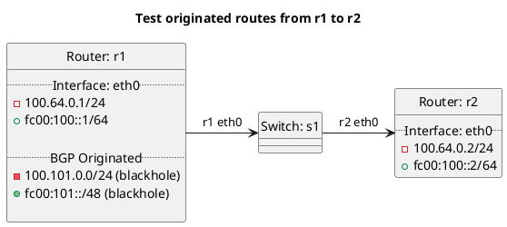

# BGP basic test to accept originated routes

Router r1 is configured with originated routes, but should not be exporting them to to r2.

In the case of "test_accept_originated": **(default)**
  - r1 should be accepting originated routes by default.

In the case of "test_accept_originated_true":
  - r1 should be accepting originated routes.

In the case of "test_accept_originated_false":
  - r1 should not be accepting originated routes.

