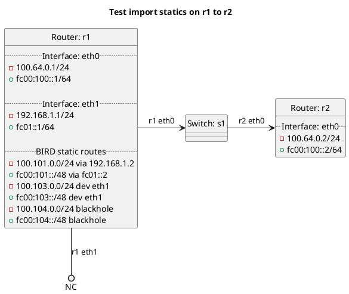

# BGP importing of BIRD static routes

Router r1 should import its static routes on interface eth1 but not export to r2.

In the case of "test_import_static": **(default)**
  - r1 should not be importing static routes by default.

In the case of "test_import_static_true":
  - r1 should be importing static routes but not blackhole routes.

In the case of "test_import_static_false":
  - r1 should not be importing static routes.

In the case of "test_import_static_blackhole_true":
  - r1 should be importing static blackhole routes but not normal static routes.

In the case of "test_import_static_blackhole_false":
  - r1 should not be importing static routes.

## Diagram

