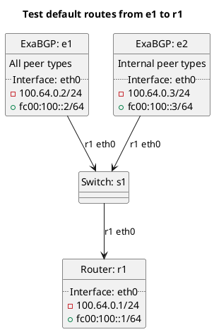

# BGP basic test to accept default routes

ExaBGP e1 should be advertising a default route to r1, depending on r1's configuration it should either be accepting or filtering the route.

ExaBGP e2 should only be advertising a default route to r1 for internal peer types, depending on r1's configuration it should either be accepting or filtering the route.

In the case of "test_peer_accept_bgp_own_default": **(default)**
  - r1 should be filtering our own default routes by default. Except in the case of rrserver_rrserver.

In the case of "test_peer_accept_bgp_own_default_true":
  - r1 should be accepting our own default routes from internal peer types, but filtering it for others.

In the case of "test_peer_accept_bgp_own_default_false":
  - r1 should be filtering our own default routes.

In the case of "test_peer_accept_bgp_transit_default": **(default)**
  - r1 should be filtering transit default routes by default. Except in the case of rrserver_rrserver.

In the case of "test_peer_accept_bgp_transit_default_true":
  - r1 should be accepting transit default routes from internal peer types, but filtering it for others.

In the case of "test_peer_accept_bgp_transit_default_false":
  - r1 should be filtering transit default routes.

In the case of "test_global_accept_bgp_own_default": **(default)**
  - r1 should not be accepting our own default routes into our master table by default.

In the case of "test_global_accept_bgp_own_default_true":
  - r1 should be accepting our own default routes into our master table.

In the case of "test_global_accept_bgp_own_default_false":
  - r1 should not be accepting our own default routes into our master table.

In the case of "test_global_accept_bgp_transit_default": **(default)**
  - r1 should not be accepting transit default routes into our master table by default.

In the case of "test_global_accept_bgp_transit_default_true":
  - r1 should be accepting transit default routes into our master table.

In the case of "test_global_accept_bgp_transit_default_false":
  - r1 should not be accepting transit default routes into our master table.

# Diagram

