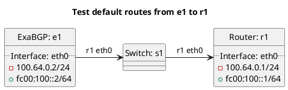

# BGP basic test to accept default routes

ExaBGP e1 should be advertising a default route to r1, depending on r1's configuration it should either be accepting or filtering the route.

In the case of "test_accept_default": **(default)**
  - r1 should not be accepting default routes by default, also we do not accept default routes from this peer.

In the case of "test_accept_default_true":
  - r1 should not be accepting default routes as we do not accept default routes from this peer.

In the case of "test_accept_default_false":
  - r1 should not be accepting default routes, also we do not accept default routes from this peer.

# Diagram

