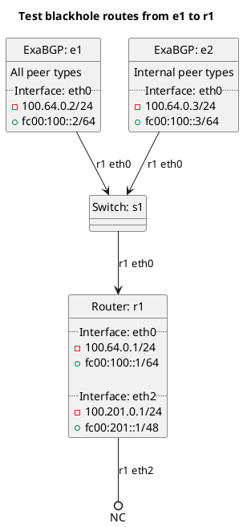

# BGP basic test to accept blackhole routes

## Peer-based setting

In the case of `test_peer_accept_bgp_own_blackhole`: **(default)**
  - r1 should be accepting our own blackhole routes by default.

In the case of `test_peer_accept_bgp_own_blackhole_true`:
  - r1 should be accepting our own blackhole routes (by default).

In the case of `test_peer_accept_bgp_own_blackhole_false`:
  - r1 should not be accepting our own blackhole routes.

In the case of `test_peer_accept_bgp_customer_blackhole`: **(default)**
  - r1 should be accepting customer blackhole routes by default.

In the case of `test_peer_accept_bgp_customer_blackhole_true`:
  - r1 should be accepting customer blackhole routes (by default).

In the case of `test_peer_accept_bgp_customer_blackhole_false`:
  - r1 should not be accepting customer blackhole routes.

## Global setting

In the case of `test_global_accept_bgp_own_blackhole`: **(default)**
  - r1 should accept our own blackhole routes into the master table by default.

In the case of `test_global_accept_bgp_own_blackhole_true`:
  - r1 should accept our own blackhole routes into the master table (by default).

In the case of `test_global_accept_bgp_own_blackhole_false`:
  - r1 should not accept our own blackhole routes into the master table.

In the case of `test_global_accept_bgp_customer_blackhole`: **(default)**
  - r1 should accept customer blackhole routes into the master table by default.

In the case of `test_global_accept_bgp_customer_blackhole_true`:
  - r1 should accept customer blackhole routes into the master table (by default).

In the case of `test_global_accept_bgp_customer_blackhole_false`:
  - r1 should not accept customer blackhole routes into the master table.

# Diagram

