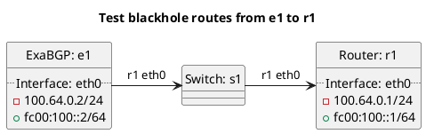

# BGP basic test to accept blackhole routes

ExaBGP e1 should be advertising a blackhole route to r1, depending on r1's configuration it should either be accepting or filtering the route.

In the case of "test_accept_blackhole": **(default)**
  - r1 should be accepting blackhole routes by default.

In the case of "test_accept_blackhole_true":
  - r1 should be accepting blackhole routes and exporting them to the master table.

In the case of "test_accept_blackhole_false":
  - r1 should not be accepting blackhole routes or exporting blackhole routes to the master table.

In the case of "test_global_accept_blackhole":
  - r1 should be accepting blackhole routes into the master table by default.

In the case of "test_global_accept_blackhole_true":
  - r1 should be accepting blackhole routes into the master table.

In the case of "test_global_accept_blackhole_false":
  - r1 should not be accepting blackhole routes into the master table.

In the case of "test_peer_accept_blackhole":
  - r1 should be accepting blackhole routes by default.

In the case of "test_peer_accept_blackhole_true":
  - r1 should be accepting blackhole routes.

In the case of "test_peer_accept_blackhole_false":
  - r1 should not be accepting blackhole routes.

# Diagram

