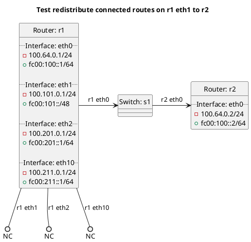

# BGP redistribution of connected routes

Router r1 should export its connected routes to r2 depending on the test case.

In the case of "redistribute_connected_false_import_connected_true":
  - r1 should import all connected routes into its BGP table but not export them to r2.

In the case of "redistribute_connected_import_connected_true":
  - r1 should import all connected routes into its BGP table but not export them to r2.

In the case of "redistribute_connected_import_connected": **(default)**
  - r1 should not import any connected routes into its BGP table and should not export any to r2.

In the case of "redistribute_connected_true_import_connected_false":
  - r1 should fail to configure with an exception, as importation of connected routes is required.

In the case of "redistribute_connected_true_import_connected_list":
  - r1 should import connected routes from eth1 into its BGP table and export it to r2.

In the case of "redistribute_connected_true_import_connected":
  - r1 should fail to configure with an exception, as importation of connected routes is required.

In the case of "redistribute_connected_true_import_connected_star":
  - r1 should import connected routes from eth1, eth10 into its BGP table and export it to r2.

In the case of "redistribute_connected_true_import_connected_true":
  - r1 should import connected routes from eth0, eth1, eth2, eth10 into its BGP table and export it to r2.

## Diagram

