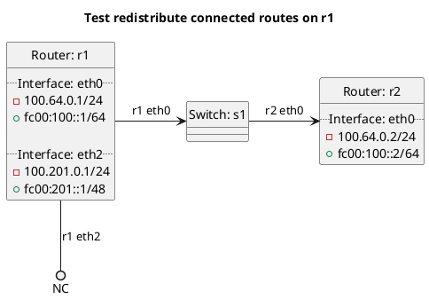

# BGP redistribution of connected routes

In the case of `redistribute_connected`: **(default)**
  - r1 should import eth2 connected routes into its BGP table and export them to r2.

In the case of `redistribute_connected_false`:
  - r1 should import eth2 connected routes into its BGP table but not export them to r2.

In the case of `redistribute_connected_true`:
  - r1 should import eth2 connected routes into its BGP table and export them to r2.

## Diagram

