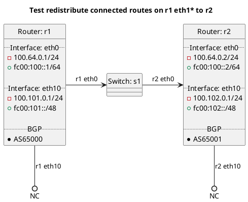

# BGP redistribution of connected routes with star

Router r1 should be exporting its connected routes for `eth1*` (eth10) to r2.

Router r2 should not export its routes on eth1* (eth10) to r1.

```plantuml
@startuml
hide circle
title Test redistribute connected routes on r1 eth1* to r2


class "Router: r1" {
  .. Interface: eth0 ..
- 100.64.0.1/24
+ fc00:100::1/64

  .. Interface: eth10 ..
- 100.101.0.1/24
+ fc00:101::/48

  .. BGP ..
* AS65000
}


class "Router: r2" {
  .. Interface: eth0 ..
- 100.64.0.2/24
+ fc00:100::2/64

  .. Interface: eth10 ..
- 100.102.0.1/24
+ fc00:102::/48

  .. BGP ..
* AS65001
}


class "Switch: s1" {}


"Router: r1" -> "Switch: s1": r1 eth0
"Switch: s1" -> "Router: r2": r2 eth0
"Router: r1" --() NC: r1 eth10
"Router: r2" --() NC: r2 eth10

@enduml
```
