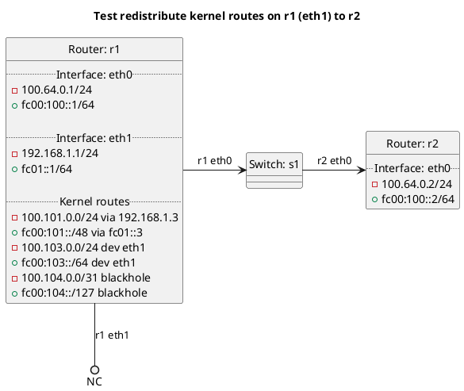

# BGP redistribution of kernel routes

Router r1 should export its kernel routes on interface eth1 to r2 depending on the test case.

In the case of "test_redistribute_kernel": **(default)**
  - r1 should not be exporting its kernel routes to r2 as this is default behavior.

In the case of "test_redistribute_kernel_true":
  - r1 should be exporting its kernel routes on interface eth1 to r2.

In the case of "test_redistribute_kernel_false":
  - r1 should not be exporting its kernel routes to r2 as `redistribute:kernel` is set to false.

In the case of "test_redistribute_kernel_blackhole": **(default)**
  - r1 should not be exporting its kernel blackhole routes to r2 as this is default behavior.

In the case of "test_redistribute_kernel_blackhole_true":
  - r1 should be exporting its kernel blackhole routes to r2 depending on the test case.

In the case of "test_redistribute_kernel_blackhole_false":
  - r1 should not be exporting its kernel blackhole routes to r2 as `redistribute:kernel_blackhole` is set to false.

In the case of "test_redistribute_kernel_default": **(default)**
  - r1 should not be exporting its kernel default routes to r2 as this is default behavior.

In the case of "test_redistribute_kernel_default_true":
  - r1 should be exporting its kernel default routes to r2 depending on the test case.

In the case of "test_redistribute_kernel_default_false":
  - r1 should not be exporting its kernel default routes to r2 as `redistribute:kernel_default` is set to false.

## Diagram

