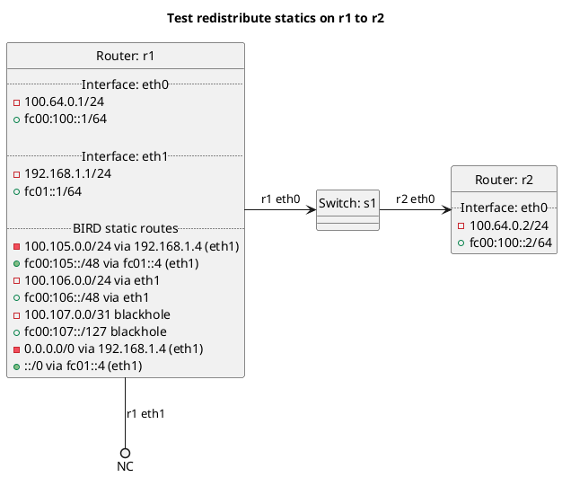

# BGP redistribution of BIRD static routes

Router r1 should export its static on interface eth1 to r2 depending on the test case.

In the case of "test_redistribute_static": **(default)**
  - r1 should not be exporting its static routes to r2 as this is default behavior.

In the case of "test_redistribute_static_true":
  - r1 should be exporting its static routes on interface eth1 to r2.

In the case of "test_redistribute_static_false":
  - r1 should not be exporting its static routes to r2 as `redistribute:static` is set to false.

In the case of "test_redistribute_static_blackhole": **(default)**
  - r1 should not be exporting its static blackhole routes to r2 as this is default behavior.

In the case of "test_redistribute_static_blackhole_true":
  - r1 should be exporting its static blackhole routes to r2 depending on the test case.

In the case of "test_redistribute_static_blackhole_false":
  - r1 should not be exporting its static blackhole routes to r2 as `redistribute:static_blackhole` is set to false.

In the case of "test_redistribute_static_default": **(default)**
  - r1 should not be exporting its static default routes to r2 as this is default behavior.

In the case of "test_redistribute_static_default_true":
  - r1 should be exporting its static default routes to r2 depending on the test case.

In the case of "test_redistribute_static_default_false":
  - r1 should not be exporting its static default routes to r2 as `redistribute:static_default` is set to false.

## Diagram

